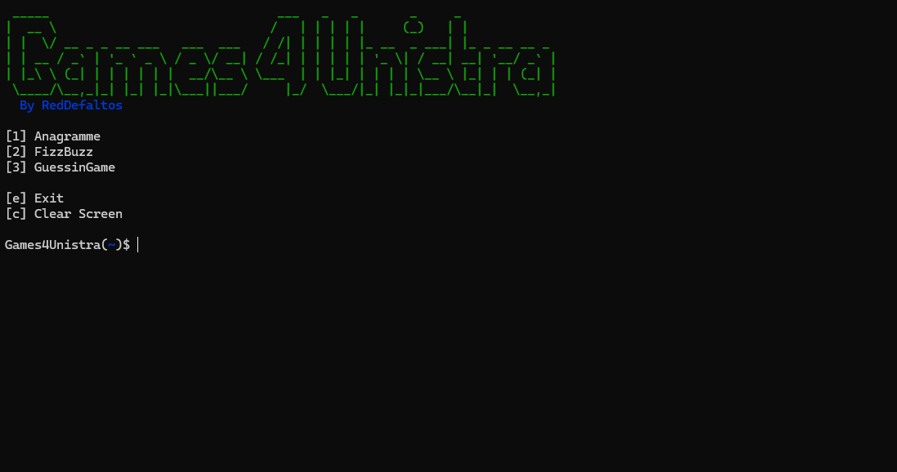
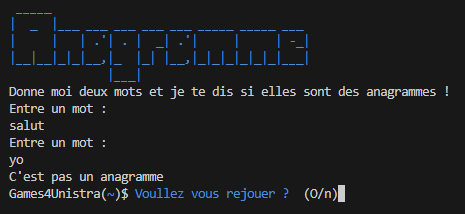
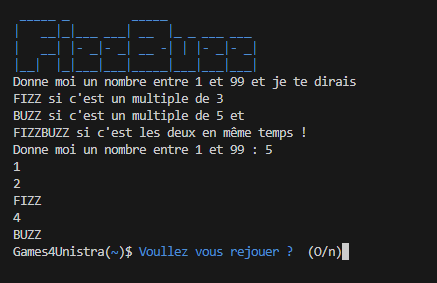
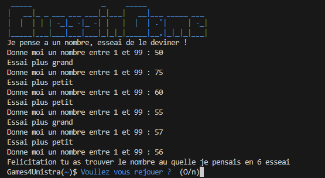

<h1 style="text-align: center; color: green;">[Multigame for unistra]</h1>

Table des Matières
=

* [Games4Unistra](#Games4Unistra)

* [Prérequis](#Prerequis)

* [Anagramme](#Anagramme)

* [FizzBuzz](#FizzBuzz)

* [GuessinGame](#GuessinGame)

* [Crédits](#Crédits)

Games4Unistra
=

[](https://youtu.be/l5F-b4VGPxU)

```
 _____                               ___   _   _       _     _
|  __ \                             /   | | | | |     (_)   | |
| |  \/ __ _ _ __ ___   ___  ___   / /| | | | | |_ __  _ ___| |_ _ __ __ _
| | __ / _` | '_ ` _ \ / _ \/ __| / /_| | | | | | '_ \| / __| __| '__/ _` |
| |_\ \ (_| | | | | | |  __/\__ \ \___  | | |_| | | | | \__ \ |_| | | (_| |
 \____/\__,_|_| |_| |_|\___||___/     |_/  \___/|_| |_|_|___/\__|_|  \__,_|
```
Games4Unistra est un projet proposé par l'université de strasbourg dans le cadre de l'UE technique de dévelopemment, au sains de cette UE nous apprenons a utiliser des outils tels que GIT Makefile Doxygene ou encore Markdown.

Prerequis
=
Cette projet naicessite gcc et makefile si vous ne les avez pas veuillez les installer

Pour obtenir l'executable <strong style="color: lightblue";>unistragames</strong> il vous suffit de taper la commande suivante

    make

Pour executer le programme il vous suffit de taper

    ./unistragames


Si vous souhaiter garder l'executable mais de nettoyer les fichiers executer

    make clean

Si vous souhaiter ne rien garder appart le code source executer

    make superclean


Anagramme
=



Anagramme est un programme qui demande a l'utilisateur d'entrer deux mots et qui indique via le terminal si les deux mots sont des anagrammes ou pas.

Ensuite demande a l'utilisateur si il veut rejouer !
Si l'utilisateur repond oui une partie ce relance si non le jeu reviens a l'ecran titre.

FizzBuzz
=



FizzBuzz est un programme qui demande a l'utilisateur d'entrer un nombre et qui compte jusqu'à ce nombre en indiquant via le terminal a chaque fois si la veuleur est un multiple de 3, 5 ou des deux.

Ensuite demande a l'utilisateur si il veut rejouer !
Si l'utilisateur repond oui une partie ce relance si non le jeu reviens a l'ecran titre.

GuessinGame
=



Gassingame est un jeu comme juste prix le but étant de deviner un nombre secret et en sachant si elle est plus grande ou plus petite que le nombre a deviner. Pour cela le programme demande a l'utilisateur d'entrer un nombre et indique si le nombre au quelle il pense est plus grande ou plus petite que la valeur secrete. Lorsque le jeueur devine le nombre secret le jeueur est felicité.

Ensuite le programme demande a l'utilisateur si il veut rejouer !
Si l'utilisateur repond oui une partie ce relance si non le jeu reviens a l'ecran titre.

Crédits
=

Ce programme est réalisé par RedDefaltos (Hrayr Mirzoyan) et par Six Night (Loic )

Vous êtes libre de le copier modifié et d'améliorer le code comme vous voulez.
